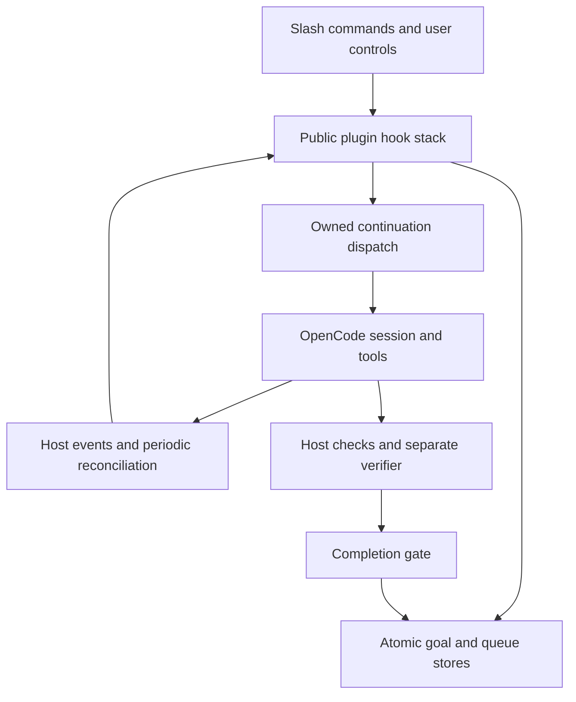

# Architecture and source map

[Documentation home](../README.md) · [Contributing](../../CONTRIBUTING.md)

## Execution path

`src/index.ts` composes the public plugin; order matters because wrappers route synthetic idle events through task, agent, compaction, budget and ownership guards. A helper that calls the core directly can accidentally bypass those guards. `src/server.ts` exposes the package server entrypoint. `src/tui/index.ts` provides the optional menu/sidebar surface.

## Modules to read before changing behavior

| Area | Source | Responsibility |
|---|---|---|
| Domain | `src/domain/goal.ts`, `types.ts`, `sequence.ts` | Create/edit/pause/resume, policy and state contracts |
| Core adapter | `src/opencode/plugin.ts` | Command ownership, turn accounting, dispatch leases, model tools and completion orchestration |
| Parser and help | `src/opencode/command.ts`, `command-help.ts`, `command-ux.ts` | Explicit creation, literal escape, generated aliases/help, receipts and errors |
| Storage | `src/persistence/store.ts`, `process-lock.ts`, `sequence-store.ts` | Atomic saves, generation checks, process locking, archive/queue activation |
| Recovery | `src/opencode/supervisor.ts`, `infrastructure-recovery.ts`, `recovery.ts` | Periodic reconciliation, provider events, timers and legacy startup handling |
| Retry policy | `src/runtime/infrastructure-recovery.ts`, `persistence-policy.ts`, `retry-after.ts` | Backoff and durable provider deadline floors |
| Host constraints | `src/opencode/task-deferral.ts`, `agent-boundary.ts`, `host-limits.ts`, `compaction-continuation.ts` | Delegation, restricted agents, context limits and compaction |
| Progress | `src/runtime/accounting.ts`, `progress.ts`, `mutation-progress.ts`; `src/opencode/shell-progress.ts` | Billable message usage, logical turns and host-observed changes |
| Verification | `src/verification/`; `src/opencode/verifier.ts` | Requirement/evidence audit, file contracts, integer oracle and semantic review |
| Process supervision | `src/runner.ts` | Authenticated local host startup, health monitoring and restart |

## Invariants

- A failure observation never authorizes changing the objective or declaring completion.
- Persistent policy survives editing and queue activation; legacy snapshots retain their existing policy.
- A provider deadline is a lower bound across local control/recovery transitions, not a backoff suggestion.
- Only explicit activation paths seed a new owned command turn. Repeating resume on an active goal must not clear its live lease.
- A late model-resume intent cannot overwrite a newer user control or a different goal revision.
- Tools consume usage even when they do not constitute another Goal turn. Notes and Todos are not proof.
- Completion checks current goal identity, revision and steering before committing a verdict.
- Corrupt/unsafe storage fails closed. Generation conflicts require reloading; retrying a stale write unchanged is not reconciliation.

## Persistence and concurrency

The existing JSON store writes temporary files and renames them into place. Process locks coordinate writers; storage generations reject stale snapshots. Test readers must select canonical `.json` snapshots and ignore temporary files.

A dispatch lease is separate from a storage lock: it describes which plugin instance owns a request and when that ownership expires. It is not an external transaction fence. The scanner reads host status before recovery; event-driven continuation remains part of the host's lifecycle. See [reliability](RELIABILITY.md) for failure boundaries.

## Public versus lower-level API

The public plugin defaults to `{ persistent: true }`. Direct domain/core consumers retain legacy defaults unless they request persistence. Public plugin options include `persistent`, `dispatchTimeoutMs`, `verifierModel` and `verifierTimeoutMs`. These are JavaScript API options; do not document them as OpenCode JSON settings unless the host integration explicitly maps them.

Avoid exporting internal modules through the package root without reviewing OpenCode's loader behavior. The public API, `./server` and `./tui` entrypoints are tested separately in package smoke.
