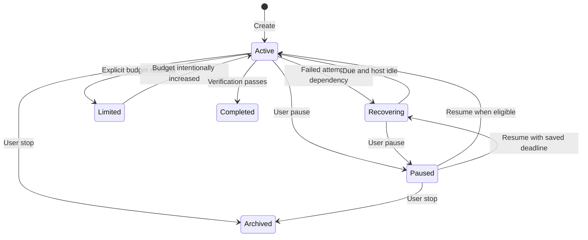

# Recovery and verification contract

[Documentation home](../README.md) · [Implementation status](../relentless/IMPLEMENTATION.md)

## The promise

For a new persistent goal, an unsuccessful attempt is not permission to declare success or silently abandon the objective. Recoverable failures leave durable retry intent. Completion requires the verification gate; explicit user controls, finite budgets and host permissions still apply.

This is conditional liveness: attempts can continue when the host is running, storage is usable, an execution context is permitted and dependencies recover. No plugin can execute on a powered-off machine or prove every natural-language statement with mathematical certainty.

“Recovering” is a conceptual substate of persisted `active`, with recovery metadata. It is not a separate stored status. Stop also works while recovering or budget-limited.

## Scheduling and retry

| Mechanism | Behavior |
|---|---|
| No-progress streak | Persistent goals schedule recovery; legacy goals retain their bounded policy. |
| Empty response | Usage is recorded; persistent recovery is scheduled without claiming useful work. |
| Repeated blocker/dependency | Remains enabled, with another check scheduled; never grants extra permissions. |
| Transport failure | Exponential base intervals start at 15 seconds, cap at five minutes, with equal jitter (half to all of the interval). No lifetime retry-count cap. |
| Provider cooldown | Supported SDK `Retry-After` values are a persisted lower bound, preserved across resume, edit and subsequent local recovery observations. |
| Lost idle event/restart | A five-second scanner loads saved active persistent goals and checks host session status. |
| Concurrent instances | Generation-checked atomic JSON writes plus expiring dispatch leases reduce duplicate dispatch. |
| Unknown host status | Failed/unreadable status does not authorize recovery dispatch. |
| User controls | Pause/stop win; a queued model-resume intent is invalidated by a newer explicit control. |

The first jittered retry can occur between approximately 7.5 and 15 seconds. A provider deadline can exceed the five-minute local backoff cap. `/goal retry` respects due times. `/goal resume` of an active goal is a no-op for dispatch; it does not clear a lease to start another request.

Token/cost/runtime usage includes tool-call rounds. A terminal assistant message counts as a Goal turn; internal tool-call messages do not each consume another logical turn. Runtime budgets measure observed assistant time, not elapsed downtime.

## What completion establishes

1. Predeclared executable checks run in the project and must succeed.
2. Predeclared file requirements are checked by the host.
3. A separate semantic verifier assesses the full objective and constraints against available evidence.
4. The completion gate rejects missing, stale or failed required proof. Supported exact integer equations receive a deterministic arithmetic verdict.
5. A detectable Git candidate change during the audit rejects completion and requires fresh verification.

A semantic verifier is still a model. Agreement between models is not an infallible truth oracle. A passing check proves only its declared scope, and an executor able to rewrite that check is not isolated from the oracle. Broad goals need carefully chosen external acceptance tests and operating boundaries.

## Limits that must stay visible

- There is no transactional external-action outbox or exactly-once receipt ledger. A timed-out request may have been accepted; a duplicate external effect is not ruled out by a local lease.
- Git comparison covers tracked and nonignored files, excluding plugin control state. Non-Git workspaces, ignored files, remote effects and unavailable/oversized markers lack this candidate fence.
- State uses atomic project-local JSON and generation checks, not an immutable remote authority. The plugin cannot recover destroyed storage without backups.
- A forever-busy host, a lost foreground-task completion hook, or a permanent dependency can require intervention. The runner addresses process/health failure, not every logical deadlock.
- The runner must own the actual host/session being used. Starting a second host does not transfer a running worker or its tools.
- Provider cooldowns are tracked for the goal, not globally across independent goals/providers/machines. Ordinary user requests are governed by the host's provider policy.
- Impossible objectives remain unverified. Continued pursuit does not authorize redefining the objective or bypassing permissions.

The proposed journal, external verifier isolation, provider-wide coordination and durable action receipts are [roadmap work](ROADMAP.md), not hidden capabilities of this beta.
